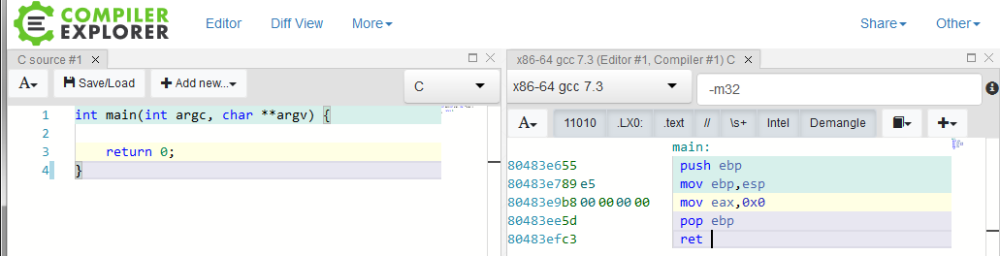

# Introduction
Pour commencer, les programmes C étudiés seront de tpye 32 bits. C'est-à-dire que les registres concernés seront du type _EAX_, avec _e_ pour _Extended_ (contrairement aux architectures 64 bits utilisant des registres de type _rax_, avec _r_ pour _Re-extended_). 

## Compilation
Il va maintenant être possible d'étudier la correspondance entre les programmes développés en C ainsi que les instructions assembleur générées. Pour compiler les différents programmes C, le compilateur **gcc** a été utilisé avec les options suivantes (ne pas oublier de remplacer le nom du fichier source et, si nécessaire, du fichier en sortie). L'environnement utilisé exécute une distribution Linux Debian9 en **32 bits** (i386) :
```
gcc -g prog.c -o prog -fno-stack-protector -z execstack -fno-pic -no-pie
```

Si la machine cible n'est pas une version 32 bits mais 64 bits alors il faudra ajouter l'option _-m32_ à **gcc** afin de le forcer à générer un binaire 32 bits :
```
gcc -g prog.c -o prog -m32 -fno-stack-protector -z execstack -fno-pic -no-pie
```

Puis pour pouvoir exécuter le binaire 32 bits ainsi généré :
```
# apt-get install libc6-i386
```

## Connaître le format d'un fichier
Afin de connaître le format d'un fichier (fichier 32 ou 64 bits par exemple), il est possible d'utiliser certains utilitaires. 

Par exemple, l'utilitaire _file_ :
```
$ file prog
monprog: ELF 32-bit LSB executable, Intel 80386, version 1 (SYSV), dynamically linked, interpreter /lib/ld-linux.so.2, for GNU/Linux 2.6.32, BuildID[sha1]=a84ab71669e2b5e391d100f22919d83a78f08da1, not stripped
```

Une alternative peut être l'utilisation de l'outil en ligne [godbolt](https://godbolt.org/) qui regroupe différentes versions de compilateurs. Afin de suivre les exemples étudiés, il faut _activer_ plusieurs options comme ci-dessous :


## Désassembler un binaire avec Objdump
Pour obtenir le code assembleur d'un programme binaire il est possible d'utiliser l'utilitaire _objdump_. L'option _-M_ permet de spécifier la syntaxe désirée :
```
$ objdump -d monprog -M intel
```

Le programme désassemblé contient plusieurs sections, mais les sections de fonctions, comme ici la section _\<main\>_, seront les sections intéressantes :
```asm
080483db <main>:
 80483db:       55                      push   ebp
 80483dc:       89 e5                   mov    ebp,esp
 80483de:       b8 00 00 00 00          mov    eax,0x0
 80483e3:       5d                      pop    ebp
 80483e4:       c3                      ret
```

**Note** : l'utilisation des registres _EBP_ ou encore _ESP_ nous donne une indication de l'architecture utilisée, soit ici une architecture 32 bits.

---

[Page précédente](02.L-assembleur.md) | [Sommaire](../../README.md) | [Page suivante](04.Les-variables.md)