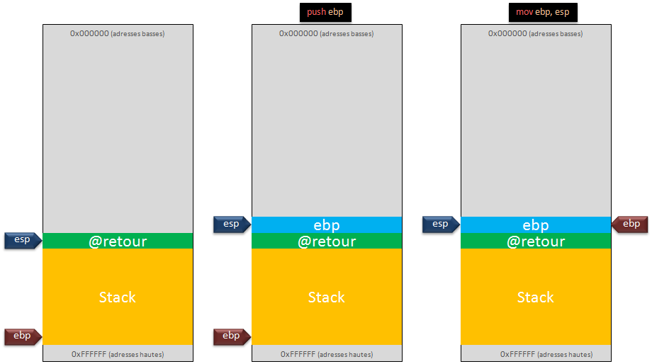
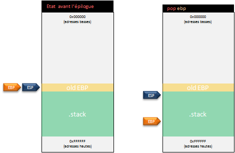

# Introduction

## Compilation
Il va maintenant être possible d'étudier la correspondance entre les programmes développés en C ainsi que les instructions assembleur générées. Pour compiler les différents programmes C, le compilateur **gcc** a été utilisé avec les options suivantes (ne pas oublier de remplacer le nom du fichier source et, si nécessaire, du fichier en sortie). L'environnement utilisé exécute une distribution Linux Debian9 en **32 bits** (i386) :
```
gcc -g prog.c -o prog -fno-stack-protector -z execstack -fno-pic -no-pie
```

Si la machine cible n'est pas une version 32 bits mais 64 bits alors il faudra ajouter l'option _-m32_ à **gcc** afin de le forcer à générer un binaire 32 bits :
```
gcc -g prog.c -o prog -m32 -fno-stack-protector -z execstack -fno-pic -no-pie
```

Puis pour pouvoir exécuter le binaire 32 bits ainsi généré :
```
# apt-get install libc6-i386
```

## Connaître le format d'un fichier
Afin de connaître le format d'un fichier (fichier 32 ou 64 bits par exemple), il est possible d'utiliser certains utilitaires. 

Par exemple, l'utilitaire _file_ :
```
$ file prog
monprog: ELF 32-bit LSB executable, Intel 80386, version 1 (SYSV), dynamically linked, interpreter /lib/ld-linux.so.2, for GNU/Linux 2.6.32, BuildID[sha1]=a84ab71669e2b5e391d100f22919d83a78f08da1, not stripped
```

Une alternative peut être l'utilisation de l'outil en ligne [godbolt](https://godbolt.org/) qui regroupe différentes versions de compilateurs. Afin de suivre les exemples étudiés, il faut _activer_ plusieurs options comme ci-dessous :


## Désassembler un binaire avec Objdump
Pour obtenir le code assembleur d'un programme binaire il est possible d'utiliser l'utilitaire _objdump_. L'option _-M_ permet de spécifier la syntaxe désirée :
```
$ objdump -d monprog -M intel
```

Le programme désassemblé contient plusieurs sections, mais les sections de fonctions, comme ici la section _\<main\>_, seront les sections intéressantes :
```asm
080483db <main>:
 80483db:       55                      push   ebp
 80483dc:       89 e5                   mov    ebp,esp
 80483de:       b8 00 00 00 00          mov    eax,0x0
 80483e3:       5d                      pop    ebp
 80483e4:       c3                      ret
```

**Note** : l'utilisation des registres _EBP_ ou encore _ESP_ nous donne une indication de l'architecture utilisée, soit ici une architecture 32 bits.

## Premier programme
Afin de commencer à manipuler les outils, le premier programme à désassembler sera une simple fonction _main()_ vide :
```c
int main() {

  return 0;
}
```

Bien que n'exécutant aucune opération, le code assembleur, lui, contient déjà quelques instructions :
```asm
01: 080483db <main>:
02:  80483db:       55                      push   ebp
03:  80483dc:       89 e5                   mov    ebp,esp
04:  80483de:       b8 00 00 00 00          mov    eax,0x0
05:  80483e3:       5d                      pop    ebp
06:  80483e4:       c3                      ret
```

Les lignes 1 et 2 sont nommées _prologue_ de la fonction. Leur but est de préparer la pile à travailler dans un nouveau contexte (nommé _stack-frame_) propre à la fonction exécutée (soit ici la fonction _main()_). La ligne 1 empile la valeur du registre _EBP_ afin de la sauvegarder (cette valeur sera restaurer à la fin de l'appel de la fonction afin de retrouver le contexte précédent). Ligne 2, le registre _EBP_ prend une nouvelle valeur, celle du registre _ESP_ (qui pointe toujours vers le sommet de la pile). Dorénavant, la nouvelle _stack-frame_ est prête.



La ligne 3 copie la valeur "0x0" dans le registre _EAX_. Le registre _EAX_ est utilisé afin de stocker la valeur de retour de la fonction, soit ici 0.

La ligne 4 et 5 sont nommées _épilogue_ de la fonction. Leur but est de retrouver le contexte précédent l'appel à la fonction. Pour cela, il suffit de dépiler dans _EBP_ la valeur qui n'est autre que la sauvegarde du registre _EBP_ effectué au début de l'appel (nommé sur le schéma _old EBP_). L'opération _ret_ permet de reprendre le flot d'exécution normal, c'est à dire d'exécuter l'instruction qui suit l'appel à la fonction (cette notion sera approfondie au chapitre 9).



Ces deux notions sont importantes à saisir afin de bien comprendre le fonctionnement de la pile. De plus, elles vont se compliquer légèrement dans les prochaines chapitres car d'autres éléments vont y être ajoutés.

---

[Page précédente](02.L-assembleur.md) | [Sommaire](../../README.md) | [Page suivante](04.Les-variables.md)