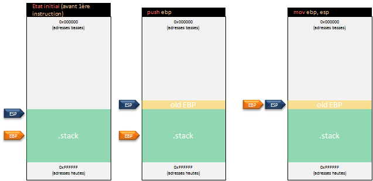
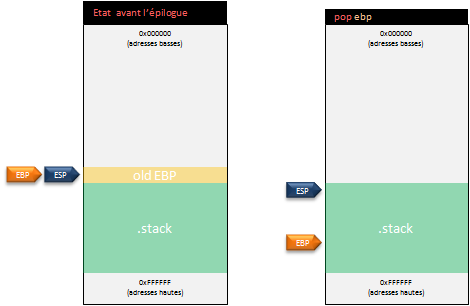

# Introduction
Pour commencer, les programmes C étudiés seront de tpye 32 bits. C'est-à-dire que les registres concernés seront du type _eax_, avec _e_ pour _Extended_ (contrairement aux architectures 64 bits utilisant des registres de type _rax_, avec _r_ pour _Re-extended_). 

## Compilation
Il va maintenant être possible d'étudier la correspondance entre les programmes développés en C ainsi que les instructions assembleur générées. Pour compiler les différents programmes C, le compilateur **gcc** a été utilisé avec les options suivantes (ne pas oublier de remplacer le nom du fichier source et, si nécessaire, du fichier en sortie). L'environnement utilisé exécute une distribution Linux Debian9 en **32 bits** (i386) :
```
gcc -g prog.c -o prog -fno-stack-protector -z execstack -fno-pic -no-pie
```

Si la machine cible n'est pas une version 32 bits mais 64 bits alors il faudra ajouter l'option _-m32_ à **gcc** afin de le forcer à générer un binaire 32 bits :
```
gcc -g prog.c -o prog -m32 -fno-stack-protector -z execstack -fno-pic -no-pie
```

Puis pour pouvoir exécuter le binaire 32 bits ainsi généré :
```
# apt-get install libc6-i386
```

## Connaître le format d'un fichier
Afin de connaître le format d'un fichier (fichier 32 ou 64 bits par exemple), il est possible d'utiliser certains utilitaires. 

Par exemple, l'utilitaire _file_ :
```
$ file prog
monprog: ELF 32-bit LSB executable, Intel 80386, version 1 (SYSV), dynamically linked, interpreter /lib/ld-linux.so.2, for GNU/Linux 2.6.32, BuildID[sha1]=a84ab71669e2b5e391d100f22919d83a78f08da1, not stripped
```

Afin de récupérer le code assembleur d'un programme, l'utilitaire **objdump** sera utilisé. Il est également possible d'utiliser d'autres outils comme **Radare2** ou **IDA Free**, mais ils s'avèrent plus complexes à prendre en main, tout du moins au début.

Une alternative peut être l'utilisation de l'outil en ligne [godbolt](https://godbolt.org/) qui regroupe différentes versions de compilateurs. Afin de suivre les exemples étudiés, il faut _activer_ plusieurs options comme sur l'image ci-dessous :


## La méthode main()
La méthode _main()_ est la méthode principale d'un programme développé en C. Les paramètres passés à cette méthode permettent de récupérer des données provenant de la ligne de commande lors de l'exécution du programme.

Voici la méthode _main()_ retournant la valeur "0" indiquant que le programme s'est correctement terminé :
```c
int main(int argc, char **argv) {

  return 0;
}
```

Le code assembleur correspondant est celui-ci (seul la partie _\<main\>_ sera analysée et la notation _intel_ sera utilisée) :
```
$ objdump -d monprog -M intel
```

```asm
080483db <main>:
 80483db:       55                      push   ebp
 80483dc:       89 e5                   mov    ebp,esp
 80483de:       b8 00 00 00 00          mov    eax,0x0
 80483e3:       5d                      pop    ebp
 80483e4:       c3                      ret
```
**Note** : l'utilisation des registres _ebp_ ou encore _esp_ nous donne une indication de l'architecture utilisée (ici 32 bits avec _e_ pour _extended_).

En mémoire, la première instruction de la méthode _main()_ est donc stockée à l'adresse _0x080483db_ et pointe (registre _eip_) vers un _push_ du registre _ebp_. Il est plus facile de considérer les deux premières instructions ensemble, car il s'agit de l'initialisation de la _stack frame_ (nommé également _prologue_) de la méthode en question :
```asm
80483db:       55                      push   ebp
80483dc:       89 e5                   mov    ebp,esp
```

**Explication :** La première ligne indique une sauvegarde de la valeur du registre _ebp_ dans la pile grâce à un _push_. Cela va permettre de sauvegarder la _stack frame_ précédente (et de pouvoir ainsi la récupérer en dépilant la pile quand cela sera nécessaire), puis de démarrer une nouvelle _stack frame_. Pour initialiser cette nouvelle _stack frame_, la valeur du registre _esp_ est copiée dans le registre _ebp_.



Ligne 3, la valeur "0" est stockée dans le registre _eax_ :
```asm
80483de:       b8 00 00 00 00          mov    eax,0x0
```

**Explication :** C'est le registre _eax_ qui contient la valeur de retour d'une fonction.

Finalement, les deux dernières instructions permettent de retrouver l'état initial avant l'appel de la méthode (nommé également épilogue) :
```asm
80483e3:       5d                      pop    ebp
80483e4:       c3                      ret
```

**Explication :** La valeur au sommet de la pile est transférée dans le registre _ebp_. Pour rappel cette valeur était en fait l'adresse de l'ancienne _stack frame_. _ebp_ retrouve donc son état initial. L'instruction _ret_ permet de retourner à la procédure appelante en dépilant l'adresse de retour.



En effet, pendant l'exécution du programme, même la méthode _main()_ possède sa propre _stack frame_ comme n'importe quelle autre fonction, bien qu'elle soit la première méthode à être appelée (en tout cas, visible au niveau du programme en langage C) et qu'un _return_ entraîne la fin du programme. L'adresse de retour dans la pile permet de retrouver le flot normal (avant l'appel) de l'exécution en mettant à jour le registre _eip_. Ces notions de _stack frame_ seront approfondies dans un chapitre dédié à l'appel des méthodes.

---

[Sommaire](../../README.md) | [Page suivante](04.Les-variables.md)