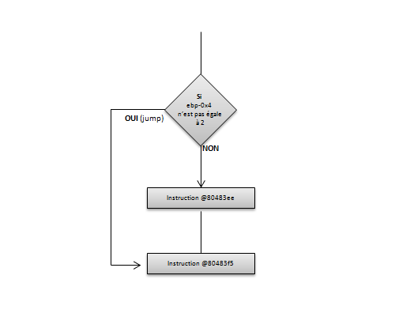
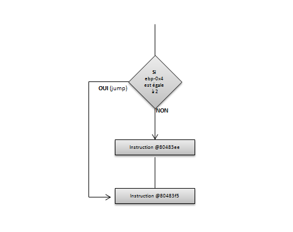

# Les conditions
Afin de continuer l'exploration du code Assembleur généré à partir des programmes 32 bits en langage C, cette partie va se concentrer sur les instructions de type **conditions**, à savoir : les _if_, _else_, _switch_ ou encore les conditions _ternaires_.

## L'instruction _if_
L'instruction _if_ permet d'exécuter (ou de ne pas exécuter) certaines instructions selon les conditions requises. Tout d'abord, un test d'égalité :
```c
int main(int argc, char **argv) {
    int nb_exploit = 2;
    char *os;

    if(nb_exploit == 2) {
         os = "Windows";
    }

    return 0;
}
```

Puis son code assembleur :
```asm
80483db:       55                      push   ebp
80483dc:       89 e5                   mov    ebp,esp
80483de:       83 ec 10                sub    esp,0x10
80483e1:       c7 45 fc 02 00 00 00    mov    DWORD PTR [ebp-0x4],0x2
80483e8:       83 7d fc 02             cmp    DWORD PTR [ebp-0x4],0x2
80483ec:       75 07                   jne    80483f5 <main+0x1a>
80483ee:       c7 45 f8 80 84 04 08    mov    DWORD PTR [ebp-0x8],0x8048480
80483f5:       b8 00 00 00 00          mov    eax,0x0
80483fa:       c9                      leave
80483fb:       c3                      ret
```

Vient en premier le _prologue_ de la fonction qui permet de créer une nouvelle _stack frame_ ainsi que de réserver l'espace sur la pile (ici 0x10 soit 16 octets) pour les variables locales. Puis vient l'affectation de la valeur "2" à la variable _nb\_exploit_ :
```asm
80483e1:       c7 45 fc 02 00 00 00    mov    DWORD PTR [ebp-0x4],0x2
```

**Explication :** La variable _nb\_exploit_ est stockée dans la pile et précisément à l'emplacement _ebp-0x4_.

Les deux prochaines instructions correspondent au test d'égalité puis au saut conditionnel :
```asm
80483e8:       83 7d fc 02             cmp    DWORD PTR [ebp-0x4],0x2
80483ec:       75 07                   jne    80483f5 <main+0x1a>
```

**Explication :** L'instruction _cmp_ compare _ebp-0x4_ (soit la variable _nb\_exploit_) à la valeur "0x2" (correspondant à "2" en décimale). L'instruction du saut peut être différente de celle attendue, ce n'est pas un saut à l'adresse _@80483ee_ si la variable vaut "2" mais bien un saut à l'adresse _@80483f5_ si la variable n'est pas égale à 2. En effet, cette condition est plus facile à réaliser qu'une instruction _je_ dans ce cas :



Le cas inverse sera alors :
```c
int main(int argc, char **argv) {
    int nb_exploit = 2;
    char *os;

    if(nb_exploit != 2) {
         os = "Windows";
    }

    return 0;
}
```

Avec son équivalent en assembleur :
```asm
80483db:       55                      push   ebp
80483dc:       89 e5                   mov    ebp,esp
80483de:       83 ec 10                sub    esp,0x10
80483e1:       c7 45 fc 02 00 00 00    mov    DWORD PTR [ebp-0x4],0x2
80483e8:       83 7d fc 02             cmp    DWORD PTR [ebp-0x4],0x2
80483ec:       74 07                   je     80483f5 <main+0x1a>
80483ee:       c7 45 f8 80 84 04 08    mov    DWORD PTR [ebp-0x8],0x8048480
80483f5:       b8 00 00 00 00          mov    eax,0x0
80483fa:       c9                      leave
80483fb:       c3                      ret
```

**Explication :** L'instruction _cmp_ compare _ebp-0x4_ (soit la variable _nb\_exploit_) à la valeur "0x2" (correspondant à "2" en décimale). L'instruction du saut ici est une instruction _je_ pour un saut vers l'adresse _@80483f5_ dans le cas où la variable vaut "2" :



Il est possible dans un _if_ d'ajouter des opérateurs logiques, par exemple **AND** (ET) ou encore **OR** (OU), voici un exemple :
```c
int main(int argc, char **argv) {
  int nb_exploit = 2;
  int vuln = 4;
  char *os;

  if(nb_exploit == 2 && vuln == 4) {
    os = "Windows";
  }
  
  return 0;
}
```

Ainsi que le code assembleur associé :
```asm
80483db:       55                      push   ebp
80483dc:       89 e5                   mov    ebp,esp
80483de:       83 ec 10                sub    esp,0x10
80483e1:       c7 45 fc 02 00 00 00    mov    DWORD PTR [ebp-0x4],0x2
80483e8:       c7 45 f8 04 00 00 00    mov    DWORD PTR [ebp-0x8],0x4
80483ef:       83 7d fc 02             cmp    DWORD PTR [ebp-0x4],0x2
80483f3:       75 0d                   jne    8048402 <main+0x27>
80483f5:       83 7d f8 04             cmp    DWORD PTR [ebp-0x8],0x4
80483f9:       75 07                   jne    8048402 <main+0x27>
80483fb:       c7 45 f4 90 84 04 08    mov    DWORD PTR [ebp-0xc],0x8048490
8048402:       b8 00 00 00 00          mov    eax,0x0
8048407:       c9                      leave
8048408:       c3                      ret
```

**Explication :** Étant donné qu'il y a deux conditions, deux tests sont bien présents au niveau du code assembleur. Il est par contre intéressant de noter que si le premier test échoue (c'est-à-dire si _nb\_exploit_ est différent de "2") alors le branchement se fait directement à l'adresse _@8048402_. Cela indique que la seconde condition ne sera jamais évaluée dans ce cas précis. En effet, si on se réfère à la table de vérité de l'opérateur logique **ET**, si la première condition est fausse alors le résultat sera forcément faux.

Pour bien illustrer ce propos, un exemple avec un **OU** :
```c
int main(int argc, char **argv) {
  int nb_exploit = 2;
  int vuln = 4;
  char *os;

  if(nb_exploit == 2 || vuln == 4) {
    os = "Windows";
  }
  
  return 0;
}
```

```asm
80483db:       55                      push   ebp
80483dc:       89 e5                   mov    ebp,esp
80483de:       83 ec 10                sub    esp,0x10
80483e1:       c7 45 fc 02 00 00 00    mov    DWORD PTR [ebp-0x4],0x2
80483e8:       c7 45 f8 04 00 00 00    mov    DWORD PTR [ebp-0x8],0x4
80483ef:       83 7d fc 02             cmp    DWORD PTR [ebp-0x4],0x2
80483f3:       74 06                   je     80483fb <main+0x20>
80483f5:       83 7d f8 04             cmp    DWORD PTR [ebp-0x8],0x4
80483f9:       75 07                   jne    8048402 <main+0x27>
80483fb:       c7 45 f4 90 84 04 08    mov    DWORD PTR [ebp-0xc],0x8048490
8048402:       b8 00 00 00 00          mov    eax,0x0
8048407:       c9                      leave
8048408:       c3                      ret
```
**Explication :** Il faut ici également se référer à la table de vérité du **OU**. Si la première condition est vraie, alors le résultat est vrai. En assembleur, cela se traduit non plus par un _jne_ pour la première condition, mais, par un _je_ qui effectuera un saut vers l'adresse _@80483fb_ (instruction présente dans le _if_). Si la première condition est fausse, il faut alors dans ce cas, vérifier la seconde condition, car, c'est elle qui déterminera le résultat du test.

## L'instruction if/else
Un _else_ est maintenant ajouté au programme :
```c
int main(int argc, char **argv) {
  int nb_exploit = 2;
  char *os;

  if(nb_exploit == 2) {
    os = "Windows";
  }
  else {
    os = "Linux";
  }

  return 0;
}
```

```asm
80483db:       55                      push   ebp
80483dc:       89 e5                   mov    ebp,esp
80483de:       83 ec 10                sub    esp,0x10
80483e1:       c7 45 fc 02 00 00 00    mov    DWORD PTR [ebp-0x4],0x2
80483e8:       83 7d fc 02             cmp    DWORD PTR [ebp-0x4],0x2
80483ec:       75 09                   jne    80483f7 <main+0x1c>
80483ee:       c7 45 f8 90 84 04 08    mov    DWORD PTR [ebp-0x8],0x8048490
80483f5:       eb 07                   jmp    80483fe <main+0x23>
80483f7:       c7 45 f8 98 84 04 08    mov    DWORD PTR [ebp-0x8],0x8048498
80483fe:       b8 00 00 00 00          mov    eax,0x0
8048403:       c9                      leave
8048404:       c3                      ret
```

**Explication :** Si la variable _nb\_exploit_ n'est pas égale à "2" alors un saut est effectué vers l'instruction à l'adresse _@80483f7_. Cette instruction va stocker la chaîne "Linux" dans le pointeur _os_. Dans le cas contraire, l'instruction stockant la chaîne "Windows" dans le pointeur _os_ sera exécutée puis un saut inconditionnel sera effectué pour arriver à la fin du programme (tout du moins, à la suite du_else_).

## Le switch
Voici un petit programme simple utilisant une condition _switch_ :
```c
int main(int argc, char **argv) {
  int nb_exploit = 2;
  char *os;

  switch (nb_exploit) {
    case 2:
      os = "MacOS";
      break;
    case 6:
      os = "Linux";
      break;
    case 12:
      os = "Android";
      break;
    default:
      os = "Windows";
      break;
  }

  return 0;
}
```

Une fois désassemblé :
```asm
80483db:       55                      push   ebp
80483dc:       89 e5                   mov    ebp,esp
80483de:       83 ec 10                sub    esp,0x10
80483e1:       c7 45 fc 02 00 00 00    mov    DWORD PTR [ebp-0x4],0x2
80483e8:       8b 45 fc                mov    eax,DWORD PTR [ebp-0x4]
80483eb:       83 f8 06                cmp    eax,0x6
80483ee:       74 13                   je     8048403 <main+0x28>
80483f0:       83 f8 0c                cmp    eax,0xc
80483f3:       74 17                   je     804840c <main+0x31>
80483f5:       83 f8 02                cmp    eax,0x2
80483f8:       75 1b                   jne    8048415 <main+0x3a>
80483fa:       c7 45 f8 b0 84 04 08    mov    DWORD PTR [ebp-0x8],0x80484b0
8048401:       eb 1a                   jmp    804841d <main+0x42>
8048403:       c7 45 f8 b6 84 04 08    mov    DWORD PTR [ebp-0x8],0x80484b6
804840a:       eb 11                   jmp    804841d <main+0x42>
804840c:       c7 45 f8 bc 84 04 08    mov    DWORD PTR [ebp-0x8],0x80484bc
8048413:       eb 08                   jmp    804841d <main+0x42>
8048415:       c7 45 f8 c4 84 04 08    mov    DWORD PTR [ebp-0x8],0x80484c4
804841c:       90                      nop
804841d:       b8 00 00 00 00          mov    eax,0x0
8048422:       c9                      leave
8048423:       c3                      ret
```

**Explication :** Le premier cas (soit : _nb\_exploit est-il égal à "6" ?) est testé, si le test est vrai alors un saut est effectué vers l'instruction permettant de stocker la chaîne de caractère "Linux" dans la variable pointeur _os_. Si ce n'est pas le cas, le second test est effectué de la même façon. Pour chaque cas (excepté le cas "default"), un saut inconditionnel est ensuite réalisé afin d'exécuter les instructions après le _switch_ (cela correspond en fait au _break_, l'objectif étant de ne pas exécuter les autres cas). Le dernier test par contre est un _jne_ et non un _je_ comme les précédents, donc le saut est effectué si le cas _default_ est sélectionné.

## La condition ternaire
Ici le programme indique que si la variable _nb\nexploit_ vaut "2" alors le système d'exploitation est de type "Windows", sinon il est de type "Linux" :
```c
int main(int argc, char **argv) {
  int nb_exploit = 2;
  char *os;

  os = (nb_exploit == 2) ? "Windows" : "Linux";
  
  return 0;
}
```

Le code assembleur associé :
```
80483db:       55                      push   ebp
80483dc:       89 e5                   mov    ebp,esp
80483de:       83 ec 10                sub    esp,0x10
80483e1:       c7 45 fc 02 00 00 00    mov    DWORD PTR [ebp-0x4],0x2
80483e8:       83 7d fc 02             cmp    DWORD PTR [ebp-0x4],0x2
80483ec:       75 07                   jne    80483f5 <main+0x1a>
80483ee:       b8 90 84 04 08          mov    eax,0x8048490
80483f3:       eb 05                   jmp    80483fa <main+0x1f>
80483f5:       b8 98 84 04 08          mov    eax,0x8048498
80483fa:       89 45 f8                mov    DWORD PTR [ebp-0x8],eax
80483fd:       b8 00 00 00 00          mov    eax,0x0
8048402:       c9                      leave
8048403:       c3                      ret
```

**Explication :** Le programme teste si la valeur du registre _ebp-0x4_ est différente de la valeur "2", si c'est le vas alors un saut est effectué à l'adresse _@80483f5_ qui a pour effet de stocker la chaîne de caractère "Linux" dans le pointeur _os_. Dans le cas contraire, la chaîne "Windows" est stockée puis un saut est effectué à la fin du programme. A noter que contrairement aux exemples précédents, l'adresse de la chaîne est tout d'abord stockée dans le registre _eax_ puis seulement à la fin du programme passé à _ebp-0x8_.

# Un peu de pratique - Challenge n°01
Il est temps de passer à la pratique. Ce challenge est de niveau "facile". Même si certaines instructions peuvent paraître encore un peu obscures pour l'instant, il suffira de ne pas y prêter attention.

Les outils déjà utilisés sont suffisants pour résoudre ce challenge : _file_ ou encore _objdump_.

[Challenge n°01](https://github.com/Sharpforce/Reverse-Engineering/tree/master/04.%20Challenges/Un%20peu%20de%20pratique%20-%20Challenge%20n%C2%B001)

---

[Sommaire](../../README.md) | [Page suivante](08.Les-boucles.md)