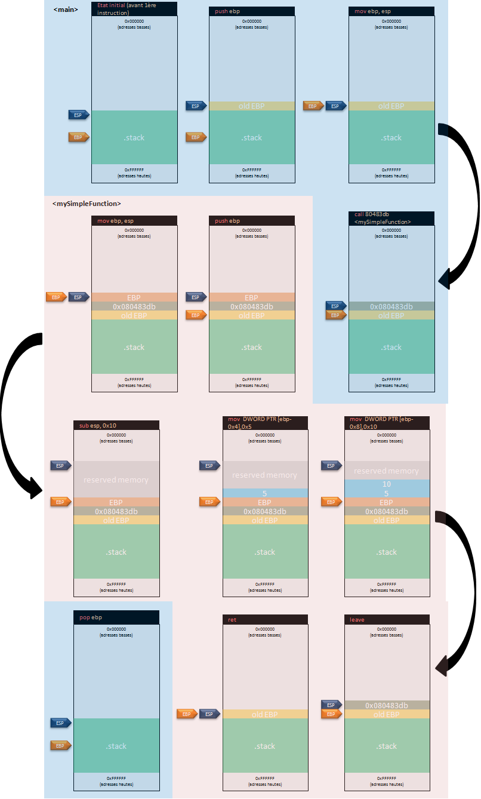
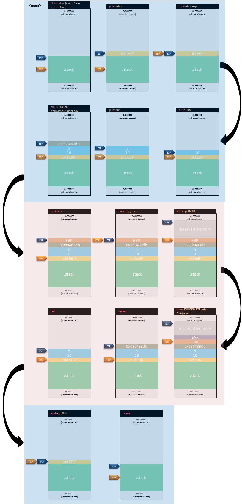

# Les fonctions
Les fonctions peuvent posséder des paramètres de différents types, renvoyer une valeur de retour ou encore être présents dans des librairies externes utilisées par le développeur. De plus, une fonction peut appeler une autre fonction (et ainsi de suite). Comme déjà vu, l'exécution d'une fonction implique la création d'un _prologue_ (initialisation de la fonction) et d'un _épilogue_ (fin de la fonction).

## Appel d'une fonction sans paramètre
Admettons l'appel d'une fonction très simple et sans aucun paramètre :
```c
void mySimpleFunction() {

}

int main(int argc, char **argv) {
  
  mySimpleFunction();

  return 0;
}
```

Le code assembleur associé :
```asm
080483f2 <main>:
01: 80483f2:       55                      push   ebp
02: 80483f3:       89 e5                   mov    ebp,esp
03: 80483f5:       e8 e1 ff ff ff          call   80483db <mySimpleFunction>
04: 80483fa:       b8 00 00 00 00          mov    eax,0x0
05: 80483ff:       5d                      pop    ebp
06: 8048400:       c3                      ret

080483db <mySimpleFunction>:
01: 80483db:       55                      push   ebp
02: 80483dc:       89 e5                   mov    ebp,esp
03: 80483de:       83 ec 10                sub    esp,0x10
04: 80483e1:       c7 45 fc 05 00 00 00    mov    DWORD PTR [ebp-0x4],0x5
05: 80483e8:       c7 45 f8 0a 00 00 00    mov    DWORD PTR [ebp-0x8],0xa
06: 80483ef:       90                      nop
07: 80483f0:       c9                      leave
08: 80483f1:       c3                      ret
```

La ligne 1 et 2 de la fonction _main()_ représentent son _prologue_. La ligne 3 est l'appel à la fonction _mySimpleFunction()_ grâce à l'instruction _call_. Cette instruction effectue deux actions particulière. Premièrement, elle met sur la pile (_push_) l'adresse de l'instruction qui suit l'exécution de la fonction appelée (soit ici _0x080483fa_ car la fonction appelée est _mySimpleFunction()_), et, deuxièmement, branche le registre _EIP_ vers l'adresse de la première instruction de la fonction appelée (soit ici _0x080483db_). La seconde instruction intéressante est à la ligne 8 de la fonction _mySimpleFunction()_. Cette instruction dépile la valeur présente sur la pile (il s'agit en fait de l'adresse empilée grâce à la fonction _call_), et branche le registre _EIP_ vers cette adresse afin de reprendre le flot d'exécution de la méthode appelante (ici _main()_). La ligne 3 est une instruction _nop_, qui indique au processeur de ne rien faire (_nop_ pour "No Operation").

Pour rappel, l'instruction _leave_ à la ligne 7 est équivalente à :
```asm
mov esp ebp
pop ebp
```



## Appel d'une fonction avec paramètres et valeur de retour
La fonction _mySimpleFunction_ prend maintenant 'a' et 'b' directement en paramètre et non plus en variables locales :
```c
int mySimpleFunction(int a, int b) {
  int c;
  c = a + b;

  return c;
}

int main(int argc, char **argv) {
  
  mySimpleFunction(5, 10);

  return 0;
}
```

Le code assembleur généré est le suivant :
```asm
080483f1 <main>:
01: 80483f1:       55                      push   ebp
02: 80483f2:       89 e5                   mov    ebp,esp
03: 80483f4:       6a 0a                   push   0xa
04: 80483f6:       6a 05                   push   0x5
05: 80483f8:       e8 de ff ff ff          call   80483db <mySimpleFunction>
06: 80483fd:       83 c4 08                add    esp,0x8
07: 8048400:       b8 00 00 00 00          mov    eax,0x0
08: 8048405:       c9                      leave
09: 8048406:       c3                      ret

080483db <mySimpleFunction>:
01: 80483db:       55                      push   ebp
02: 80483dc:       89 e5                   mov    ebp,esp
03: 80483de:       83 ec 10                sub    esp,0x10
04: 80483e1:       8b 55 08                mov    edx,DWORD PTR [ebp+0x8]
05: 80483e4:       8b 45 0c                mov    eax,DWORD PTR [ebp+0xc]
06: 80483e7:       01 d0                   add    eax,edx
07: 80483e9:       89 45 fc                mov    DWORD PTR [ebp-0x4],eax
08: 80483ec:       8b 45 fc                mov    eax,DWORD PTR [ebp-0x4]
09: 80483ef:       c9                      leave
10: 80483f0:       c3                      ret
```

Au niveau de la fonction _main()_, avant l'opération _call_, deux valeurs sont empilées sur la pile, ligne 3 et 4. Il s'agit de la valeur 5 (variable nommée "a" dans la fonction _mySimpleFunction()_) et de la valeur 10 (variable nommée "b" dans la fonction _mySimpleFunction()_). Les valeurs sont empilées en commençant par le dernier paramètre de la fonction puis en terminant par le premier (on empile d'abord la valeur 01 puis la valeur 5). La fonction _mysimplefunction()_ reste simple et les instructions qui y sont présentes ont déjà été rencontrées. L'instruction ligne 6 de la fonction _main()_ peut sembler étrange. Il s'agit en fait de récupérer l'espace sur la pile dû aux empilements des valeurs 10 et 5 (chaque entier prend 4 octets, on ajoute donc à _ESP_ 2 * 4 octets soit 8 octets).



---

[Page précédente](08.Les-boucles.md) | [Sommaire](../../README.md))