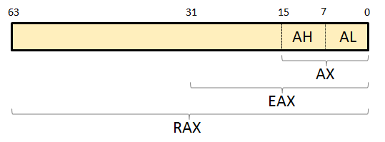

# De x86 à x64
L'architecture x64 étend l'architecture x86 et ajoute quelques nouveautés aux précédents concepts étudiés.

## Modification des registres
La taille des registres évolue en passant de 32 bits (architexture x86) à 64 bits. Le nom des registres évoluent également, en remplaçant le *E* d'*Extended* (architecture x86) par la lettre *R*, pour *_Re\_extended*. Voici ces modifications regroupées dans les tableaux suivants :

|    16 bits    |     32 bits     |     64 bits    |
| :-----------: | :-------------: | :------------: |
|       AX      |        EAX      |      RAX       |
|       BX      |        EBX      |      RBX       |
|       CX      |        ECX      |      RCX       |
|       DX      |        EDX      |      RDX       |

|    16 bits    |     32 bits     |     64 bits    |
| :-----------: | :-------------: | :------------: |
|       SI      |        ESI      |      RSI       |
|       DI      |        EDI      |      RDI       |

|    16 bits    |     32 bits     |     64 bits    |
| :-----------: | :-------------: | :------------: |
|       IP      |        EIP      |      RIP       |
|       BP      |        EBP      |      RBP       |
|       SP      |        ESP      |      RSP       |

|    16 bits    |     32 bits     |     64 bits    |
| :-----------: | :-------------: | :------------: |
|     FLAGS     |      EFLAGS     |     RFLAGS     |

* Concernant l’architecture 32 bits le *E* signifie *Extended*.
* Concernant l’architecture 32 bits le *R* signifie *Re-extended*.

Le découpage peut alors s'effectuer comme ceci (registre _RAX_) :

Enfin le nombre des registres généraux doublent, en passant de 8 à 16 registres.

## Passage des paramètres de fonction
Une modification importante à saisir, est la manière de passer des paramètres à une fonction. Pour rappel, en architecture x86, le passage s'effectue via la pile (opération _push_ du dernier jusqu'au premier paramètre). Ces paramètres étaient ensuite récupérés grâce à un calcul en fonction du registre _EBP_.

L'architecture x64 change la donne en utilisant un autre mécanisme également dépendant du système d'exploitation. Sous Windows 64 bits, les quatre premiers paramètres sont passés par les registres _RCX_, _RDX_, _R8_ puis _R9_. Si la fonction possède plus de paramètres, alors les paramètres supplémentaires sont passés par la pile, de droite à gauche (en reprenant donc ce qui avait été fait pour l'architecture x86). Sous Linux, les 5 premiers paramètres sont passés par les registres _RDI_, _RSI_, _RDX_, _R8_ puis _R9_. Le principe reste également le même pour d'éventuels paramètres supplémentaires.

---

[Page précédente](XX.Les-binaires-stripped.md) | [Sommaire](../../README.md)